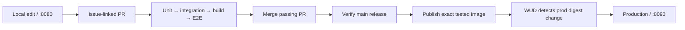

# Toothpaste quiz CI/CD (IS373 practical test)

**Production:** https://bmctiernan.com
**QA:** https://qa.bmctiernan.com

Image registry: [hub.docker.com/r/mcbridgeee/is373-ci-cd](https://hub.docker.com/r/mcbridgeee/is373-ci-cd) · [Workflow runs](https://github.com/mcbridgeee/is373-ci-cd/actions/workflows/ci.yml) · [Test Evidence](#test-evidence)

## Promotion rule

- Push to the **`qa`** branch → CI tests, builds, and pushes `mcbridgeee/is373-ci-cd:qa` (plus `qa-sha-<commit>`) → the droplet's QA container updates → **https://qa.bmctiernan.com**.
- After checking QA, open a PR from `qa` into **`main`** and merge it → CI pushes `:prod` (plus `sha-<commit>`) → the production container updates → **https://bmctiernan.com**.
- QA and production are separate containers that follow separate tags (`:qa` and `:prod`), so nothing on QA reaches production until it is merged into `main`.

## How CI/CD works

A push to `qa` or `main` (and every pull request) starts `.github/workflows/ci.yml`. The `verify` job runs unit tests, API integration tests, builds the Docker image once from the `Dockerfile`, runs browser (Playwright) tests against that image, and scans it with Trivy; if any step fails the job stops and the `publish` job never runs, so nothing is deployed. On a `qa` or `main` push, `publish` loads the exact tested image (no rebuild), logs in to Docker Hub with the `DOCKER_PAT` GitHub Actions secret, and pushes an immutable commit tag plus the moving `:qa` or `:prod` tag. On the DigitalOcean droplet, WUD (What's Up Docker, [compose.yaml](compose.yaml)) checks Docker Hub every 5 minutes and automatically recreates the `qa` or `prod` container when its tag points at a new image; Traefik ([deploy/compose.traefik.yaml](deploy/compose.traefik.yaml)) serves them over HTTPS with Let's Encrypt certificates. Deployment is pull-based: GitHub never holds SSH access to the server.

## Test Evidence

| | QA | Production |
| --- | --- | --- |
| Workflow run | QA_RUN | PROD_RUN |
| Deployed commit / tag | QA_TAG | PROD_TAG |
| Registry | [mcbridgeee/is373-ci-cd:qa](https://hub.docker.com/r/mcbridgeee/is373-ci-cd/tags) | [mcbridgeee/is373-ci-cd:prod](https://hub.docker.com/r/mcbridgeee/is373-ci-cd/tags) |

**Visible change** (CHANGE_DESC): first on QA while production still showed the old page, then on production after merging `qa` into `main`.

| QA after the push to `qa` | Production before the merge | Production after the merge |
| --- | --- | --- |
|  |  |  |

**SSH security** (droplet user `bridge`, key-only):


`sudo sshd -T | grep -Ei 'permitrootlogin|passwordauthentication'` reports `permitrootlogin no` and `passwordauthentication no`. Attempts to log in as `root`, or with a password, are refused (shown live in class). Full hardening checklist: [server-of-love/security](https://github.com/mcbridgeee/server-of-love/tree/main/security). More history: [docs/evidence.md](docs/evidence.md).

---

## About the app

A small FastAPI toothpaste-recommendation quiz that makes the path from a local edit to a tested production release visible. One HTML page tallies an answer in JavaScript, a backend API independently recomputes it, and the page shows whether the two agree. No matter what you answer, the recommendation is always **Sensodyne** — that's the whole joke. The point of the project is the CI/CD pipeline and the dual-computation pattern around it, not the quiz.

The same app also serves a **calculator** (`/calc`, and `https://calc.bmctiernan.com` once deployed) that matches the reference repo's demo: the browser calculates, the API recalculates, and the page shows **Results match**. Same image, same tests, same pipeline (#44).

This repo follows the development and delivery process demonstrated in [kaw393939/is373_ci_cd](https://github.com/kaw393939/is373_ci_cd) — structure and workflow only; the application content is intentionally different.

**Status:** live on the DigitalOcean droplet: production at https://bmctiernan.com (also `quiz.` and `calc.`), QA at https://qa.bmctiernan.com. See the [hosting runbook](docs/hosting.md).

## Delivery flow (target)



Only a passing `main` push publishes. PRs and manual verification never publish. Each release gets a `sha-<full-commit>` tag and the mutable `prod` channel.

## Run the demo locally

```sh
git clone git@github.com:mcbridgeee/is373-ci-cd.git
cd is373-ci-cd
make setup
make browsers
make up
```

| Service | Default address | Behavior |
| --- | --- | --- |
| Development | [localhost:8080](http://localhost:8080) | Mounted local source with reload |
| Production | [localhost:8090](http://localhost:8090) | Last passing image from Docker Hub |
| WUD dashboard | [localhost:8091](http://localhost:8091) | Authenticated image monitoring and updates |

## Test and operate

```sh
make test-unit          # Pure Python quiz-scoring logic and validation
make test-integration   # Real FastAPI request/response contracts
make build               # Build the release image once
make test-e2e            # Chromium against that image on an isolated port
make status               # Running services and production release
make check-updates       # Ask WUD to check the registry now
make down                 # Stop this project's services; keep WUD data
```

## Specifications and development

- [Product specification](docs/spec.md): numbered requirement IDs and HTTP contract.
- [Architecture](docs/architecture.md): components, runtime decisions.
- [Testing strategy](docs/testing.md): the three boundaries.
- [CI/CD specification](docs/ci-cd.md): gates, versioning, publication, rollback.
- [Hosting](docs/hosting.md): the droplet runbook for `https://quiz.bmctiernan.com`.
- [Security](docs/security.md): controls by layer and the image scan policy.
- [Demo script](docs/demo.md): what to show, in order, with likely questions.
- [Evidence](docs/evidence.md): run links, releases, blocked PRs, and rehearsal results.
- [Implementation plan](docs/implementation-plan.md): the ordered issue backlog.
- [Contributing](CONTRIBUTING.md), [AI instructions](AGENTS.md), and [GitHub policy](docs/github-workflow.md).

[Issues](https://github.com/mcbridgeee/is373-ci-cd/issues) · [Milestone](https://github.com/mcbridgeee/is373-ci-cd/milestone/1) · [Actions](https://github.com/mcbridgeee/is373-ci-cd/actions) · [Commit history](https://github.com/mcbridgeee/is373-ci-cd/commits/main/)
