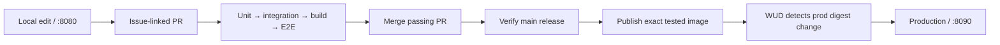

# Toothpaste quiz CI/CD demo

A small FastAPI toothpaste-recommendation quiz that makes the path from a local edit to a tested production release visible. One HTML page tallies an answer in JavaScript, a backend API independently recomputes it, and the page shows whether the two agree. No matter what you answer, the recommendation is always **Sensodyne** — that's the whole joke. The point of the project is the CI/CD pipeline and the dual-computation pattern around it, not the quiz.

This repo follows the development and delivery process demonstrated in [kaw393939/is373_ci_cd](https://github.com/kaw393939/is373_ci_cd) — structure and workflow only; the application content is intentionally different.

**Status:** the quiz, its API, and unit/integration/browser tests are done (#3, #4). Containers, the CI/CD pipeline, and public hosting at `quiz.bmctiernan.com` are in progress. See the [implementation plan](docs/implementation-plan.md) for the ordered backlog.

## Delivery flow (target)



Only a passing `main` push publishes. PRs and manual verification never publish. Each release gets a `sha-<full-commit>` tag and the mutable `prod` channel.

## Run the demo (once implemented)

```sh
git clone git@github.com:mcbridgeee/is373-ci-cd.git
cd is373-ci-cd
make setup
make browsers
make up
```

| Service | Default address | Behavior |
| --- | --- | --- |
| Development | [localhost:8080](http://localhost:8080) | Mounted local source with reload |
| Production | [localhost:8090](http://localhost:8090) | Last passing image from Docker Hub |
| WUD dashboard | [localhost:8091](http://localhost:8091) | Authenticated image monitoring and updates |

## Test and operate (once implemented)

```sh
make test-unit          # Pure Python quiz-scoring logic and validation
make test-integration   # Real FastAPI request/response contracts
make build               # Build the release image once
make test-e2e            # Chromium against that image on an isolated port
make status               # Running services and production release
make check-updates       # Ask WUD to check the registry now
make down                 # Stop this project's services; keep WUD data
```

## Specifications and development

- [Product specification](docs/spec.md): numbered requirement IDs and HTTP contract.
- [Architecture](docs/architecture.md): components, runtime decisions.
- [Testing strategy](docs/testing.md): the three boundaries.
- [CI/CD specification](docs/ci-cd.md): gates, versioning, publication, rollback.
- [Implementation plan](docs/implementation-plan.md): the ordered issue backlog.
- [Contributing](CONTRIBUTING.md), [AI instructions](AGENTS.md), and [GitHub policy](docs/github-workflow.md).

[Issues](https://github.com/mcbridgeee/is373-ci-cd/issues) · [Milestone](https://github.com/mcbridgeee/is373-ci-cd/milestone/1) · [Actions](https://github.com/mcbridgeee/is373-ci-cd/actions) · [Commit history](https://github.com/mcbridgeee/is373-ci-cd/commits/main/)
