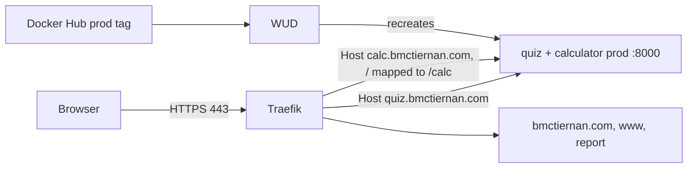

# Hosting: quiz.bmctiernan.com and calc.bmctiernan.com on the droplet

How the published quiz image reaches `https://quiz.bmctiernan.com` (issue 18). It follows the instructor's split: [373_hosting chapter 10](https://github.com/kaw393939/373_hosting/blob/main/book/10-application-delivery.md) for the idea, and [server-of-love](https://github.com/mcbridgeee/server-of-love) for this server's routing adapter.

## Who owns what

| This repo (is373-ci-cd) | server-of-love |
| --- | --- |
| Quiz code, Dockerfile, tests, publishing | Ubuntu, Docker, DNS, Traefik, certificates |
| `make deploy` / `rollback` / `resume-updates`, WUD | `integrations/quiz/` routing adapter |

The contract between them: container port `8000`, `GET /health` reporting the release commit and `environment`, and an optional `compose.override.yaml` that this repo's commands always load.



Only Traefik publishes public ports.

## Rehearsed before the real deploy

These steps were run in the authoring sandbox against a local Traefik v3.7.13 started with the same flags as the hosting generator (network `hosting-web`, `websecure`, HTTP→HTTPS redirect), plus an Apache site for `bmctiernan.com`. That covered a fresh clone of `main` at `cb6124d`, the `server-of-love` adapter, and the deploy steps. Results:

- `verify-production`: running image = selected image, commit `cb6124d…`, `environment: production`
- `https://quiz.bmctiernan.com/health` through Traefik: same commit; `http://` → `301 https://`
- Headers: `strict-transport-security: max-age=31536000` (Traefik), plus the app's CSP, `nosniff`, `X-Frame-Options: DENY`; `/docs` → 404
- The `bmctiernan.com` site still 200; `prod` published only on `127.0.0.1:8090`

Not rehearsed: real DNS and Let's Encrypt (the sandbox used Traefik's default certificate). `prod` stays on `127.0.0.1:8090` for checks, and WUD stays on `127.0.0.1:8091`.

## One-time setup on the droplet

Run these over SSH on the droplet. `#` lines are notes, not commands.

### 1. DNS

At your DNS provider, add an **A record**: host `quiz`, value = the droplet's IP (the same IP as `bmctiernan.com`). Then check it from anywhere:

```bash
dig +short quiz.bmctiernan.com      # must print the droplet's IP
dig +short calc.bmctiernan.com      # same IP (add a second A record: host `calc`)
```

Don't add `quiz.bmctiernan.com` or `calc.bmctiernan.com` to `hosting.json` `sites`. That would create an Apache router fighting the quiz for the same name.

### 2. Check the server

```bash
uname -m                                   # x86_64 (the image is amd64 only)
sudo docker network ls | grep hosting-web  # Traefik's network must exist
sudo apt-get install -y make               # if 'make' is missing
```

### 3. Get the deployment files

Log in as your own sudo user (on this droplet: `bridge`, home `/home/bridge`), not root. `373_hosting` is already in your home folder; `is373-ci-cd` and `server-of-love` go next to it.

Both repos are private, so the droplet needs read-only access. A **deploy key** reads one repo and nothing else, and GitHub won't reuse a key across repos, so make one per repo:

```bash
ssh-keygen -t ed25519 -f ~/.ssh/deploy_quiz -N "" -C "droplet read is373-ci-cd"
ssh-keygen -t ed25519 -f ~/.ssh/deploy_sol  -N "" -C "droplet read server-of-love"
cat ~/.ssh/deploy_quiz.pub ~/.ssh/deploy_sol.pub
```

On GitHub, add each one under **that repo → Settings → Deploy keys → Add deploy key**, with **Allow write access unchecked**.

Then give each key a name in `~/.ssh/config` (create the file if it doesn't exist), so git picks the right key:

```
Host github-quiz
  HostName github.com
  User git
  IdentityFile ~/.ssh/deploy_quiz
  IdentitiesOnly yes

Host github-sol
  HostName github.com
  User git
  IdentityFile ~/.ssh/deploy_sol
  IdentitiesOnly yes
```

```bash
chmod 600 ~/.ssh/config
cd ~
git clone git@github-quiz:mcbridgeee/is373-ci-cd.git      # first time: answer "yes" to GitHub's fingerprint
git clone git@github-sol:mcbridgeee/server-of-love.git
ls ~                                                       # 373_hosting  is373-ci-cd  server-of-love
```

`git pull` in either folder keeps using its own key. Production pulls the tested image from Docker Hub; nothing is built on the server.

### 4. Install the routing adapter

```bash
cd ~/server-of-love && git pull
cp ~/server-of-love/integrations/quiz/compose.traefik.yaml ~/is373-ci-cd/compose.override.yaml
cp ~/server-of-love/integrations/quiz/.env.example ~/is373-ci-cd/.env
cd ~/is373-ci-cd
cat .env                                   # APP_HOST=quiz.bmctiernan.com, CALC_HOST=calc.bmctiernan.com, TRAEFIK_NETWORK=hosting-web
sudo docker compose config --quiet && echo "config ok"
```

### 5. Deploy

```bash
sudo make deploy
```

This pulls `mcbridgeee/is373-ci-cd:prod` and starts **only** `prod`. It then checks that the running container is that image and that `/health` reports the image's commit with `environment: production`, and only after that starts WUD. It generates WUD's login into `.state/wud.env` (readable only by root).

## Check it worked

From your own computer, or the droplet:

```bash
curl -sS https://quiz.bmctiernan.com/health
curl -sS https://calc.bmctiernan.com/health                # same commit: one container serves both
curl -sS https://calc.bmctiernan.com/ | grep -o "<h1>Calculator</h1>"
# {"status":"ok","commit":"<40 characters>","built_at":"...","environment":"production"}

curl -sS -o /dev/null -w "%{http_code} %{redirect_url}\n" http://quiz.bmctiernan.com/   # 301 https://quiz.bmctiernan.com/
curl -sS -D - -o /dev/null https://quiz.bmctiernan.com/ | grep -i -E "strict-transport|content-security|x-content-type"

for h in bmctiernan.com www.bmctiernan.com report.bmctiernan.com; do
  curl -s -o /dev/null -w "$h %{http_code}\n" https://$h
done                                                      # all still 200
```

The commit must equal the one in the latest **CI / CD → publish** run summary on GitHub. Then open the page in a browser, take the quiz, and check the footer shows the same commit.

### 6. After it's live

- In GitHub, add the repository variable `DEPLOYED_SCAN_ENABLED` = `true` (**Settings → Secrets and variables → Actions → Variables**) so the live release gets rescanned daily (issue 19). Then **Actions → Deployed image security → Run workflow** once to see it pass.
- Turn on the `main` branch ruleset described in [github-workflow.md](github-workflow.md#branch-policy).

## Day to day

| Task | Command (in `~/is373-ci-cd`) |
| --- | --- |
| See what's running | `sudo make status` |
| New release | Merge a PR. CI publishes, then WUD replaces `prod` within about 5 minutes |
| Check now instead of waiting | `sudo make check-updates` |
| Prove what's running | `sudo make verify-production` |
| Roll back | `sudo make rollback RELEASE=sha-<full commit>` (WUD pauses) |
| Go back to automatic updates | `sudo make resume-updates` |
| Update the deploy files | `git pull` (release code arrives via the image, not git) |

To open WUD's dashboard, tunnel it from your computer: `ssh -L 8091:127.0.0.1:8091 <you>@<droplet-ip>`, then visit `http://localhost:8091`. The login is in `sudo cat ~/is373-ci-cd/.state/wud.env`. Never give WUD a public route: it controls Docker on the droplet.

Keep `.state/`, `.env`, and `compose.override.yaml`. They hold the rollback pin, WUD's login, and the route.

## If something's wrong

| Symptom | Likely cause | Check |
| --- | --- | --- |
| `network hosting-web declared as external, but could not be found` | Traefik's network has a different name | `sudo docker network ls`; set `TRAEFIK_NETWORK` in `.env` |
| `404 page not found` from Traefik | Router missing or wrong host | `sudo docker inspect is373-ci-cd-prod-1 --format '{{json .Config.Labels}}'` |
| Browser certificate warning | DNS not pointing here yet, or Let's Encrypt still issuing | `dig +short quiz.bmctiernan.com`; `sudo docker logs hosting373-traefik-1 \| grep -i acme` |
| `502 Bad Gateway` | prod not on `hosting-web`, or not healthy | `sudo make status` |
| `404 page not found` for a few seconds right after an update or rollback | Traefik picks up the new container once it starts (about 2–4 s in the rehearsal) | wait; if it lasts, check `sudo make status` |
| `verify-production` fails on commit | WUD replaced prod mid-check, or an old release | rerun; roll back only to releases from #7 onward |
| `429 Too Many Requests` on pull | Docker Hub's anonymous pull limit for this IP | wait and retry; WUD checks only every 5 minutes to stay well under it |
| `curl -I` shows `405` | The app answers GET, not HEAD | use the GET-based checks above |
